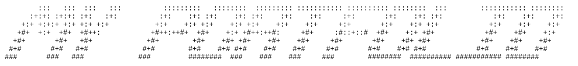

<h1 align="center">💖 Hi! I'm Yana 💖</h1>

  

 Automation & AI Engineer • Data Science • Industrial IoT

  
  
  

  

---

## 
🌸 About Me 🌸

| 🎓 Education | 🤖 Interested in: | 
|--------------|-----------|
| Automation & AI engineer from KPI (Kyiv Polytechnic Institute) | Machine learning • Control systems • Industrial IoT • Data analysis for engineering systems |

 
  🢃  🢃  🢃 
  [portfolio](https://sites.google.com/view/kostiv-yanina-portfolio?usp=sharing) (ukrainian)

## 
 ⚙️ Engineering Projects ⚙️

| Project | Description | Links | Technologies |
|--------|-------------|-------------|------------|
| 🔥 [Furnace Control System](https://github.com/SuperYanka/vacuum-distillation-control-system) | Diploma. Mathematical modeling and PI/MPC control of tubular furnace | [GitHub](https://github.com/SuperYanka/intelligent-data-analysis-projects) [Website](https://sites.google.com/view/kostiv-vdm-automation?usp=sharing)|  MATLAB, Simulink |
| ⚙️ [PLC Control Systems](https://github.com/SuperYanka/plc-discrete-output-control) | Control of Lomikont L-110, PLC-154 and MIK-51 controllers | [GitHub](https://github.com/SuperYanka/intelligent-data-analysis-projects) | CoDeSys, ST, FBD | 
| 🌐 [Industrial IoT Furnace](https://github.com/SuperYanka/esp32-iot-furnace-monitoring) | ESP32 based monitoring system using MQTT  | [GitHub](https://github.com/SuperYanka/intelligent-data-analysis-projects) | ESP32, MQTT, Flask |

## 
 🤖 Machine Learning Projects 🤖 

| Project | Description | Links | Technologies |
|:--|:--|:--|--|
| 🧠 [Intelligent Industrial Data Analysis](https://github.com/SuperYanka/intelligent-data-analysis-projects) | intelligent data analysis methods for industrial process monitoring data | [GitHub](https://github.com/SuperYanka/intelligent-data-analysis-projects) | Matlab
| 🧠 [Sentiment Analysis](https://github.com/SuperYanka/imdb-sentiment-analysis-nlp) | Sentiment classification of IMDB reviews | [GitHub](https://github.com/SuperYanka/imdb-sentiment-analysis-nlp) · [Kaggle](https://www.kaggle.com/code/yaninakostiv/imdb-sentiment-analysis-with-tf-idf-lr-nb) | python nlp word2vec sklearn
| 📊 [House Prices](https://github.com/SuperYanka/house-prices-regression) | House price prediction project | [GitHub](https://github.com/SuperYanka/house-prices-regression) · [Kaggle](https://www.kaggle.com/code/yaninakostiv/eda-house-prices) | python docker machine-learning scikit-learn regression pandas randomforest ridge-regression lasso-regression

<!-- 
## 📊 GitHub Activity

  

-->

## 
 My Tech Stack

| Data Science & ML | Backend & DevOps | Frontend & Web |
|----------------------|----------------------|------------------|
|  |  |  |

| Databases | Design & Media | Tools & Platforms |
|--------------|------------------|----------------------|
|  |  |  |

<!--
## 
🏆 GitHub Trophy

## 

  

-->

<!--
## 📈 GitHub Stats

  
  

-->

## 
🧁 Fun Facts 🧁

| 🌵 Cacti | 🎼 Music | 🎨 Creativity | 🎮 YouTube |🌐 [Personal Website](https://superyanka-website.netlify.app/)
|:--|:--|:--|:--|:--|
| Collect cacti (main one: **Stas**) | Play instruments | Love drawing & design | [@superyankaplay](https://www.youtube.com/@superyankaplay) |  Neon animated autobiographical portfolio website [GitHub](https://github.com/SuperYanka/superyanka-website) |

<h2 align="center">💌 Contact 💌</h2>

  
  
  
  

   
  

<!-- 🪄 Hello to the one reading the code... You’ve found Yana's secret message! 🌟 -->
